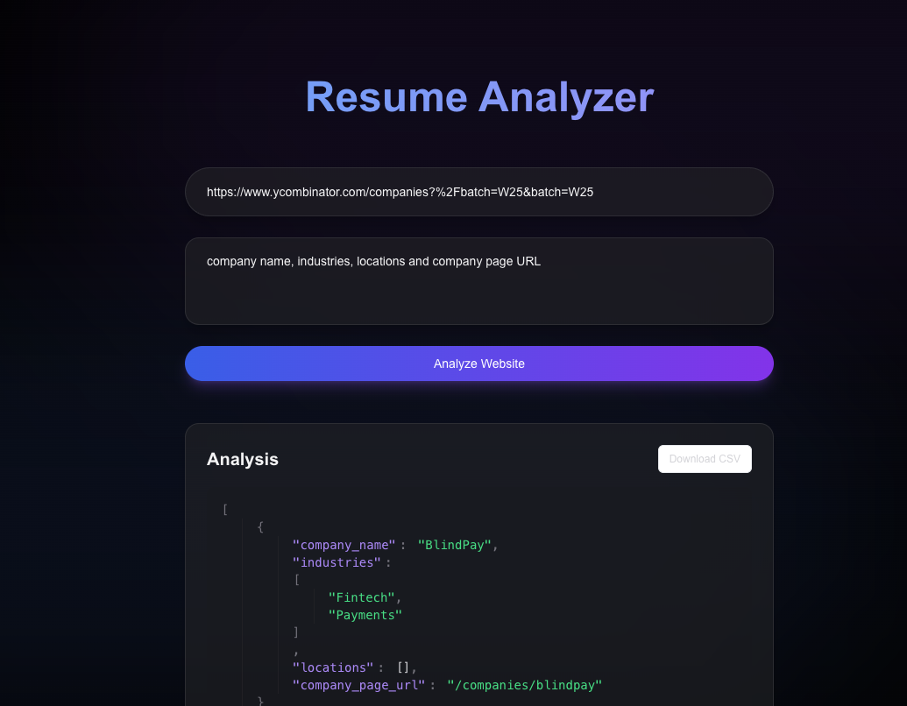
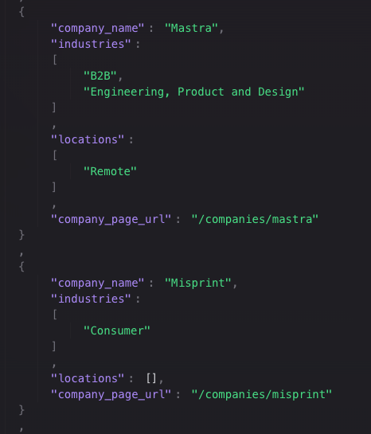
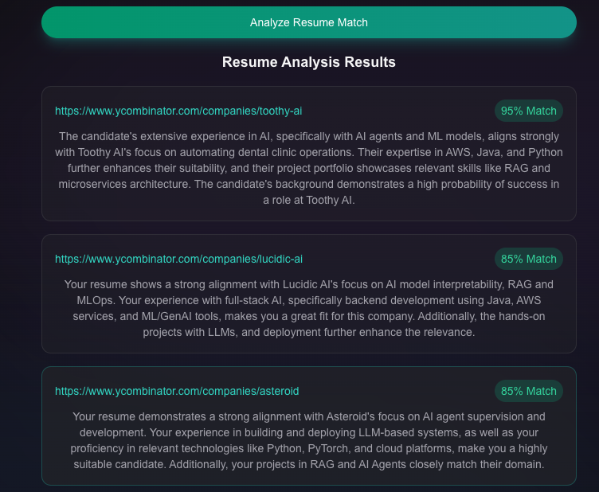
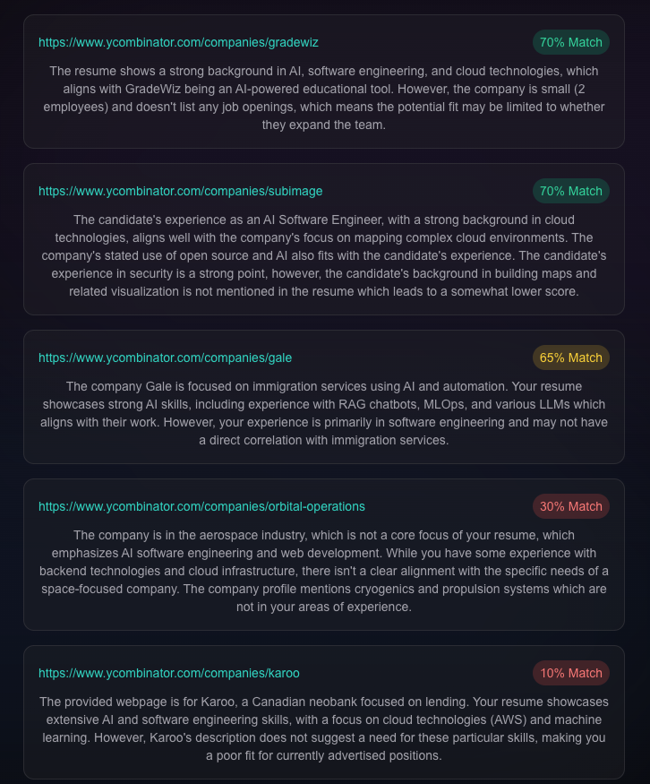
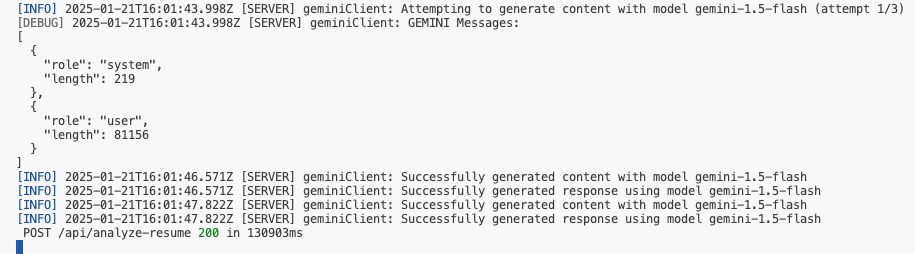

# Analyzer: AI Agent

Paste in a website URL and extract structured data from it using LLMs.

- Scraping YC to find the startups that best align with your resume




## Scrapping results

- As per prompt we got data in structured format:
  -  company name, 
  -  industries domain, 
  -  location 
  -  company page url



## Resume match



## Resume not a match



## Gemini results




## Getting Started

1. First, clone the repository and cd into the directory
```
git clone https://github.com/iaamar/web-agent
cd web-agent
```

2. Install the dependencies
```
npm install
```

3. Run `npm run dev` to start the development server
```
npm run dev
```

Open [http://localhost:3000](http://localhost:3000) with your browser to see the result.


## Gemini API Key
- Get your API key to access Google Gemini [here](https://aistudio.google.com/apikey)